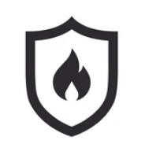
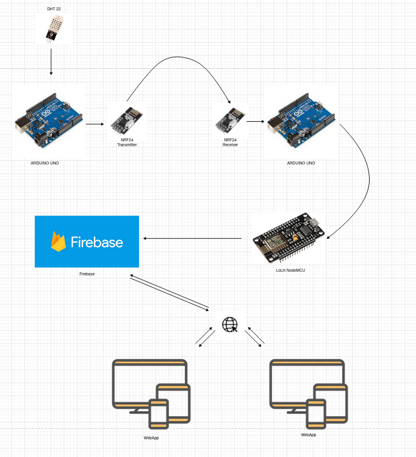
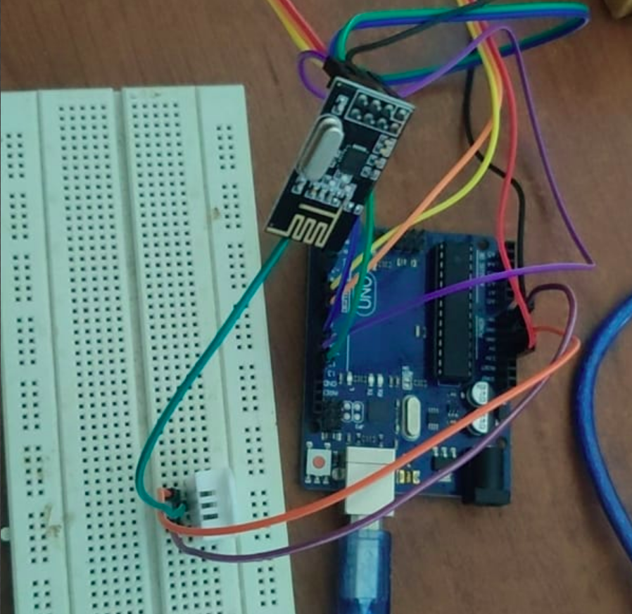
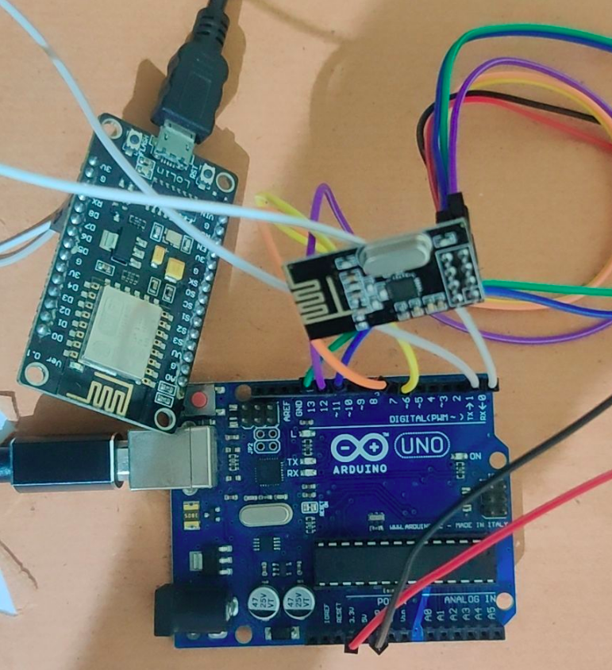
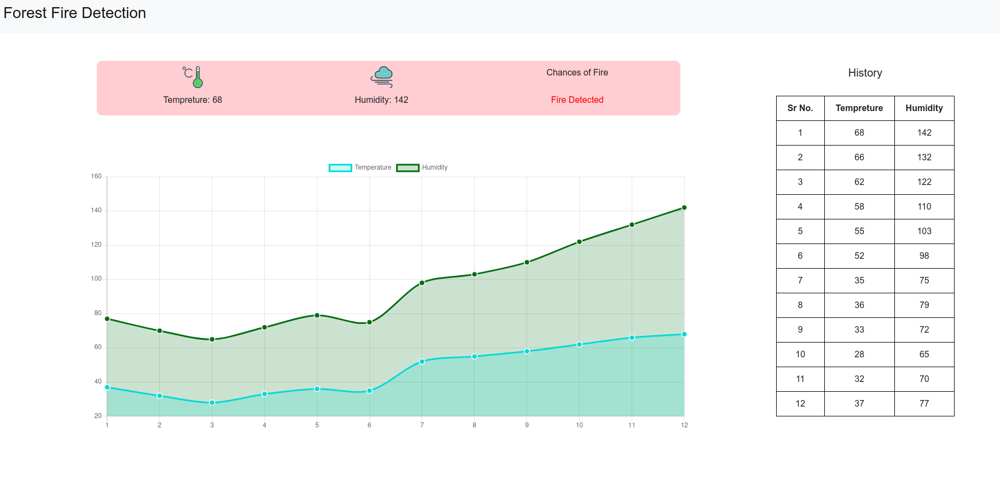

# Project: Forest-Fire-Detection

<!--
*** Thanks for checking out the Best-README-Template. If you have a suggestion
*** that would make this better, please fork the repo and create a pull request
*** or simply open an issue with the tag "enhancement".
*** Thanks again! Now go create something AMAZING! :D
-->

<!-- PROJECT SHIELDS -->
<!--
*** I'm using markdown "reference style" links for readability.
*** Reference links are enclosed in brackets [ ] instead of parentheses ( ).
*** See the bottom of this document for the declaration of the reference variables
*** for contributors-url, forks-url, etc. This is an optional, concise syntax you may use.
*** https://www.markdownguide.org/basic-syntax/#reference-style-links
-->
[![Contributors][contributors-shield]][contributors-url]
[![Forks][forks-shield]][forks-url]
[![Stargazers][stars-shield]][stars-url]
[![Issues][issues-shield]][issues-url]
[![MIT License][license-shield]][license-url]
[![LinkedIn][linkedin-shield]][linkedin-url]
<!--  -->

<!-- PROJECT LOGO -->
 

  

  <h3 align="center">SAFE FOREST</h3>

  

    System to detect forest fires
     
    <a href="https://github.com/SravanChittupalli/Forest-Fire-Detection"><strong>Explore the docs »</strong></a>
     
     
    <!-- <a href="https://github.com/othneildrew/Best-README-Template">View Demo</a> -->
    ·
    <a href="https://github.com/SravanChittupalli/Forest-Fire-Detection/issues">Report Bug</a>
  

<!-- TABLE OF CONTENTS -->

  
Table of Contents

  <ol>
    <li>
      <a href="#about-the-project">About The Project</a>
    </li>
    <li>
      <a href="#flow-chart">Flow Chart</a>
    </li>
    <li>
      <a href="#getting-started">Getting Started</a>
      <ul>
        <li><a href="#hardware-side">Hardware</a></li>
        <li><a href="#software-side">Softtware</a></li>
      </ul>
    </li>
    <li><a href="#setting-up">Setting Up</a></li>
    <li><a href="#license">License</a></li>
  </ol>

<!-- ABOUT THE PROJECT -->
## About The Project

This project is in accordance with the UNSDG Goal 13: Climate Change & Goal 15: Forest and Biodiversity. The motive of choosing the project for detection of forest fires is to overcome the demerits present in the existing technologies of MODIS and Basic Wireless Sensor Network based Forest Fire Detection Systems. Hence we are developing a more robust and reliable system.
The project is split into three sub-modules for step by step development and implementation. 
  1) Forest Area Module
  2) Data Transfer Module
  3) GUI Display Module

## Flow Chart

  

  1) Data is received from DHT22 sensor by the arduino uno
  2) This data is sent to the arduino uno at receiving side using the NRF24 module
  3) The data received at the receiver end is transmitted to the Lolin NodeMCU via serial communication port
  4) The Lolin Board is connected to the wifi. It pushes the data to a real time database

We take the readings every 15 seconds. Now we need a good way to visualize the raw data that we are getting from the Forest area module. Hence we created an excellent and user-friendly web application where we will be showing the real time data and analytics.

<!-- GETTING STARTED -->
## Getting Started
### Hardware Side

  
  

Hardware components used for the project: 
  1) 2 x Arduino Uno:  
  The Arduino Uno is an open-source microcontroller board based on the Microchip ATmega328P microcontroller and developed by Arduino.cc. We are using this to collect data from DHT22 module, send and receive data to and from NRF24 module.

  2) 1 x DHT22 Temperature & Humidity Sensor:   
  The DHT22 is a basic, low-cost digital temperature and humidity sensor. It uses a capacitive humidity sensor and a thermistor to measure the surrounding air, and spits out a digital signal on the data pin (no analog input pins needed). It's fairly simple to use, but requires careful timing to grab data. The only real downside of this sensor is you can only get new data from it once every 2 seconds

  3) 2 x nRF24L01 Transreceiver Module:  
  As we know there is no network coverage in the forest area so we cannot use direct ip based data transmission techniques. Hence we are using NRF24 module. Using these we are able to communicate with each other wirelessly over a distance. The nRF24L01+ transceiver module is designed to operate in 2.4 GHz worldwide ISM frequency band and uses GFSK modulation for data transmission. The data transfer rate can be one of 250kbps, 1Mbps and 2Mbps. We will be using the 250kbps rate of transfer as it provides the longest range. 

  4) 1 x LoLin NodeMCU:  
  LoLin board comes ith built-in wifi. We are using the wifi capabilities of the LoLin board to push the data received by the NRF24 module to a real time data base. 

### Software Side

  

Libraries used to make the web application:
  1) HTML, CSS:
  The HyperText Markup Language, or HTML is the standard markup language for documents designed to be displayed in a web browser. CSS is the language for describing the presentation of Web pages, including colors, layout, and fonts. These were used to make the webpage.

  2) Chart.js:
  Chart.js is a free open-source JavaScript library for data visualization, which supports 8 chart types: bar, line, area, pie (doughnut), bubble, radar, polar, and scatter. The chart visible in the diagram above was made using chart.js

  3) Flask:
  Flask is a micro web framework written in Python. It is designed to make getting started quick and easy, with the ability to scale up to complex applications.

### Setting up

1. For connections between arduino and DHT22:  
  https://create.arduino.cc/projecthub/mafzal/temperature-monitoring-with-dht22-arduino-15b013

2. For connection between arduino and nrf24:  
  https://lastminuteengineers.com/nrf24l01-arduino-wireless-communication/

3. For serial communication between arduino and NodeMCU:  
  https://www.youtube.com/watch?v=6-RXqFS_UtU

4. For NodeMCU to communicate with Firebase:  
  https://github.com/mobizt/Firebase-ESP8266

5. To run the web application:  
  Install the necessary libraries. Then run using `python app.py`

<!-- LICENSE -->
## License

Distributed under the MIT License. See `LICENSE` for more information.

<!-- MARKDOWN LINKS & IMAGES -->
<!-- https://www.markdownguide.org/basic-syntax/#reference-style-links -->
[contributors-shield]: https://img.shields.io/github/contributors/SravanChittupalli/Forest-Fire-Detection.svg?style=for-the-badge
[contributors-url]: https://github.com/othneildrew/Best-README-Template/graphs/contributors
[forks-shield]: https://img.shields.io/github/forks/SravanChittupalli/Forest-Fire-Detection.svg?style=for-the-badge
[forks-url]: https://github.com/SravanChittupalli/Forest-Fire-Detection/network/members
[stars-shield]: https://img.shields.io/github/stars/SravanChittupalli/Forest-Fire-Detection.svg?style=for-the-badge
[stars-url]: https://github.com/SravanChittupalli/Forest-Fire-Detection/stargazers
[issues-shield]: https://img.shields.io/github/issues/SravanChittupalli/Forest-Fire-Detection.svg?style=for-the-badge
[issues-url]: https://github.com/SravanChittupalli/Forest-Fire-Detection/issues
[license-shield]: https://img.shields.io/github/license/SravanChittupalli/Forest-Fire-Detection.svg?style=for-the-badge
[license-url]: https://github.com/SravanChittupalli/Forest-Fire-Detection/blob/main/LICENSE
[linkedin-shield]: https://img.shields.io/badge/-LinkedIn-black.svg?style=for-the-badge&logo=linkedin&colorB=555
[linkedin-url]: https://linkedin.com/in/othneildrew
[product-screenshot]: images/screenshot.png
